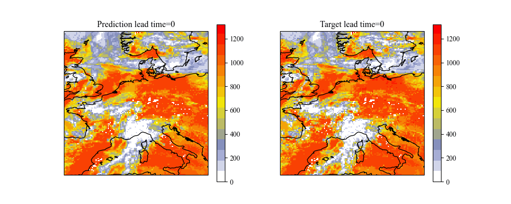

# **WIP-Flow**

## Satellite derived solar irradiance data
You guys can download regional solar irradiance data throught [CM SAF](https://wui.cmsaf.eu/safira/action/viewProduktSearch).

### Prediction Surface Solar Irradiance.

